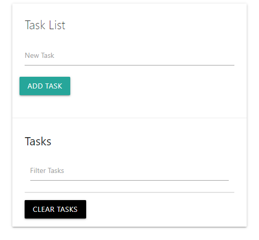

# Task List Project

---

"HTML" - "Materialize CSS" - "JavaScript"

You can add new tasks or remove them. Tasks will stored at local storage then you can reload the page and your tasks will stay until you remove them. Also there is a filter function to find the task which you are looking for.

---

###                                                 Project Image

